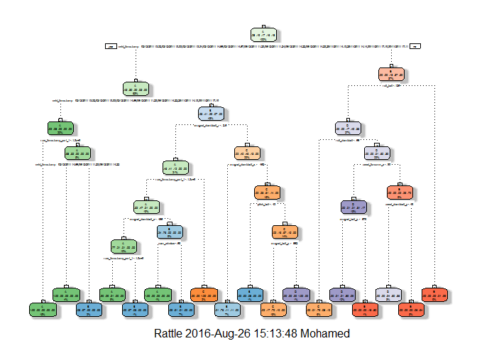
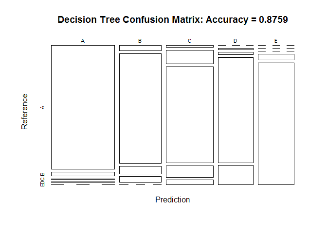
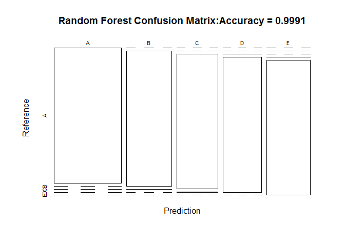
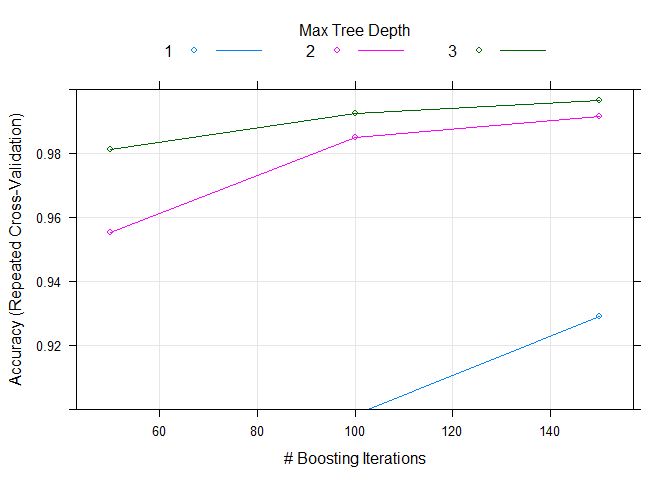

# Practical Machine Learning Final Project
Mohamed A. Nour  
Wednesday, August 26, 2016  


## Project Introduction ##

####Background####

Using devices such as Jawbone Up, Nike FuelBand, and Fitbit it is now possible to collect a large amount of data about personal activity relatively inexpensively. These type of devices are part of the quantified self movement - a group of enthusiasts who take measurements about themselves regularly to improve their health, to find patterns in their behavior, or because they are tech geeks. One thing that people regularly do is quantify how much of a particular activity they do, but they rarely quantify how well they do it. In this project, our goal will be to use data from accelerometers on the belt, forearm, arm, and dumbell of 6 participants. They were asked to perform barbell lifts correctly and incorrectly in 5 different ways. More information is available from the website here: http://groupware.les.inf.puc-rio.br/har (see the section on the Weight Lifting Exercise Dataset). 

#### Data ####

Training Data: 
https://d396qusza40orc.cloudfront.net/predmachlearn/pml-training.csv

Test Data: 
https://d396qusza40orc.cloudfront.net/predmachlearn/pml-testing.csv


#### Goal ####

The goal is to predict the manner in which they did the exercise. 
This is the "classe" variable in the training set. We may use any of the other variables to predict with. In the process, we will discuss the model, cross validation,  the expected sample error , and justification of the choices. We will use the prediction model to predict 20 different test cases. 


#### R Library Used ####

The list of used R libraries as follows:


```r
library(lattice)
library(plyr)
library(gbm)
library(splines)
library(survival)
library(ggplot2)
library(randomForest)
library(caret)
library(rpart)
library(rpart.plot)
library(RColorBrewer)
library(rattle)
library(knitr)
```


## Getting and loading the data ##


```r
set.seed(11111)

trainUrl <- "http://d396qusza40orc.cloudfront.net/predmachlearn/pml-training.csv"
testUrl <- "http://d396qusza40orc.cloudfront.net/predmachlearn/pml-testing.csv"

training <- read.csv(url(trainUrl), na.strings=c("NA","#DIV/0!",""))

testing <- read.csv(url(testUrl), na.strings=c("NA","#DIV/0!",""))
```

Partioning the training set into two


```r
inTrain <- createDataPartition(training$classe, p=0.6, list=FALSE)
myTraining <- training[inTrain, ]
myTesting <- training[-inTrain, ]
dim(myTraining); dim(myTesting)
```

```
## [1] 11776   160
```

```
## [1] 7846  160
```

## Cleaning the data ##

Remove NearZeroVariance variables:In order to predict classes in the validation sample, I'll need to use features that are non-zero in the validation data set. 


```r
nzv <- nearZeroVar(myTraining, saveMetrics=TRUE)
myTraining <- myTraining[,nzv$nzv==FALSE]

nzv<- nearZeroVar(myTesting,saveMetrics=TRUE)
myTesting <- myTesting[,nzv$nzv==FALSE]
```

Remove the first column of the myTraining data set

```r
myTraining <- myTraining[c(-1)]
```

Clean variables with more than 70% NA

```r
trainingV3 <- myTraining
for(i in 1:length(myTraining)) {
    if( sum( is.na( myTraining[, i] ) ) /nrow(myTraining) >= .7) {
        for(j in 1:length(trainingV3)) {
            if( length( grep(names(myTraining[i]), names(trainingV3)[j]) ) == 1)  {
                trainingV3 <- trainingV3[ , -j]
            }   
        } 
    }
}

# Set back to the original variable name
myTraining <- trainingV3
rm(trainingV3)
```

Transform the myTesting and testing data sets

```r
clean1 <- colnames(myTraining)
clean2 <- colnames(myTraining[, -58])  # remove the classe column
myTesting <- myTesting[clean1]         # allow only variables in myTesting that are also in myTraining
testing <- testing[clean2]             # allow only variables in testing that are also in myTraining

dim(myTesting)
```

```
## [1] 7846   58
```

```r
dim(testing)
```

```
## [1] 20 57
```

Coerce the data into the same type

```r
for (i in 1:length(testing) ) {
    for(j in 1:length(myTraining)) {
        if( length( grep(names(myTraining[i]), names(testing)[j]) ) == 1)  {
            class(testing[j]) <- class(myTraining[i])
        }      
    }      
}

# To get the same class between testing and myTraining
testing <- rbind(myTraining[2, -58] , testing)
testing <- testing[-1,]
```
## Model Description ##

For this project I'll use 3 differnt model algorithms and then look to see which provides the best out-of-sample accuracty. The three model types I'm going to test are:
1-Predicting with decision tree
2-Predicting with randon forest
3-Predicting with generlized boosted regression 


## Prediction with Decision Trees ##

```r
set.seed(11111)
modFitA1 <- rpart(classe ~ ., data=myTraining, method="class")
fancyRpartPlot(modFitA1)
```

<!-- -->

```r
predictionsA1 <- predict(modFitA1, myTesting, type = "class")
cmtree <- confusionMatrix(predictionsA1, myTesting$classe)
cmtree
```

```
## Confusion Matrix and Statistics
## 
##           Reference
## Prediction    A    B    C    D    E
##          A 2150   66    9    2    0
##          B   59 1264   87   63    0
##          C   23  176 1251  147   63
##          D    0   12   21 1015  187
##          E    0    0    0   59 1192
## 
## Overall Statistics
##                                           
##                Accuracy : 0.8759          
##                  95% CI : (0.8684, 0.8831)
##     No Information Rate : 0.2845          
##     P-Value [Acc > NIR] : < 2.2e-16       
##                                           
##                   Kappa : 0.843           
##  Mcnemar's Test P-Value : NA              
## 
## Statistics by Class:
## 
##                      Class: A Class: B Class: C Class: D Class: E
## Sensitivity            0.9633   0.8327   0.9145   0.7893   0.8266
## Specificity            0.9863   0.9670   0.9369   0.9665   0.9908
## Pos Pred Value         0.9654   0.8581   0.7536   0.8219   0.9528
## Neg Pred Value         0.9854   0.9601   0.9811   0.9590   0.9621
## Prevalence             0.2845   0.1935   0.1744   0.1639   0.1838
## Detection Rate         0.2740   0.1611   0.1594   0.1294   0.1519
## Detection Prevalence   0.2838   0.1877   0.2116   0.1574   0.1594
## Balanced Accuracy      0.9748   0.8998   0.9257   0.8779   0.9087
```

```r
plot(cmtree$table, col = cmtree$byClass, main = paste("Decision Tree Confusion Matrix: Accuracy =", round(cmtree$overall['Accuracy'], 4)))
```

<!-- -->

## Prediction with Random Forests ##

```r
set.seed(11111)
modFitB1 <- randomForest(classe ~ ., data=myTraining)
predictionB1 <- predict(modFitB1, myTesting, type = "class")
cmrf <- confusionMatrix(predictionB1, myTesting$classe)
cmrf
```

```
## Confusion Matrix and Statistics
## 
##           Reference
## Prediction    A    B    C    D    E
##          A 2232    0    0    0    0
##          B    0 1518    1    0    0
##          C    0    0 1366    3    0
##          D    0    0    1 1281    0
##          E    0    0    0    2 1442
## 
## Overall Statistics
##                                           
##                Accuracy : 0.9991          
##                  95% CI : (0.9982, 0.9996)
##     No Information Rate : 0.2845          
##     P-Value [Acc > NIR] : < 2.2e-16       
##                                           
##                   Kappa : 0.9989          
##  Mcnemar's Test P-Value : NA              
## 
## Statistics by Class:
## 
##                      Class: A Class: B Class: C Class: D Class: E
## Sensitivity            1.0000   1.0000   0.9985   0.9961   1.0000
## Specificity            1.0000   0.9998   0.9995   0.9998   0.9997
## Pos Pred Value         1.0000   0.9993   0.9978   0.9992   0.9986
## Neg Pred Value         1.0000   1.0000   0.9997   0.9992   1.0000
## Prevalence             0.2845   0.1935   0.1744   0.1639   0.1838
## Detection Rate         0.2845   0.1935   0.1741   0.1633   0.1838
## Detection Prevalence   0.2845   0.1936   0.1745   0.1634   0.1840
## Balanced Accuracy      1.0000   0.9999   0.9990   0.9980   0.9998
```

```r
plot(cmrf$table, col = cmtree$byClass, main = paste("Random Forest Confusion Matrix:Accuracy =", round(cmrf$overall['Accuracy'], 4)))
```

<!-- -->

##  Prediction with Generalized Boosted Regression ##

```r
set.seed(11111)
fitControl <- trainControl(method = "repeatedcv",
                           number = 5,
                           repeats = 1)

gbmFit1 <- train(classe ~ ., data=myTraining, method = "gbm",
                 trControl = fitControl,
                 verbose = FALSE)


gbmFinMod1 <- gbmFit1$finalModel

gbmPredTest <- predict(gbmFit1, newdata=myTesting)
gbmAccuracyTest <- confusionMatrix(gbmPredTest, myTesting$classe)
gbmAccuracyTest
```

```
## Confusion Matrix and Statistics
## 
##           Reference
## Prediction    A    B    C    D    E
##          A 2232    0    0    0    0
##          B    0 1513    1    0    0
##          C    0    3 1357    7    0
##          D    0    2   10 1275    0
##          E    0    0    0    4 1442
## 
## Overall Statistics
##                                          
##                Accuracy : 0.9966         
##                  95% CI : (0.995, 0.9977)
##     No Information Rate : 0.2845         
##     P-Value [Acc > NIR] : < 2.2e-16      
##                                          
##                   Kappa : 0.9956         
##  Mcnemar's Test P-Value : NA             
## 
## Statistics by Class:
## 
##                      Class: A Class: B Class: C Class: D Class: E
## Sensitivity            1.0000   0.9967   0.9920   0.9914   1.0000
## Specificity            1.0000   0.9998   0.9985   0.9982   0.9994
## Pos Pred Value         1.0000   0.9993   0.9927   0.9907   0.9972
## Neg Pred Value         1.0000   0.9992   0.9983   0.9983   1.0000
## Prevalence             0.2845   0.1935   0.1744   0.1639   0.1838
## Detection Rate         0.2845   0.1928   0.1730   0.1625   0.1838
## Detection Prevalence   0.2845   0.1930   0.1742   0.1640   0.1843
## Balanced Accuracy      1.0000   0.9983   0.9952   0.9948   0.9997
```

```r
plot(gbmFit1, ylim=c(0.9, 1))
```

<!-- -->

## Predicting Results on the Test Data ##


Random Forests gave an Accuracy in the myTesting dataset of 99.91%, which is higher accuracy than Decision Trees (87.59%) or GBM (99.66%).  The expected out-of-sample error is 100-99.91 = 0.09%.


```r
predictionB2 <- predict(modFitB1, testing, type = "class")
predictionB2
```

```
##  2  3 41  5  6  7  8  9 10 11 12 13 14 15 16 17 18 19 20 21 
##  B  A  B  A  A  E  D  B  A  A  B  C  B  A  E  E  A  B  B  B 
## Levels: A B C D E
```

## Conclusion ##
Using Randon Forest or GBM with the data available, we are able provide robust prediction with high accuracy.
